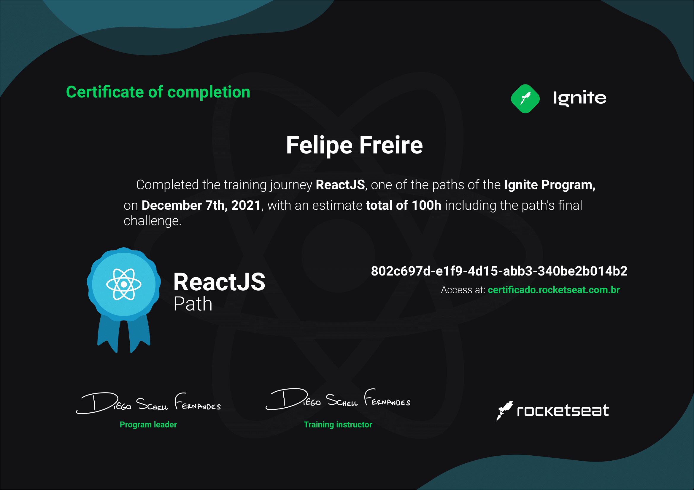

## Ignite-React

<!-- PROJECT SHIELDS -->

![TypeScript][typescript-shield]
![Next][next-shield]
![HTML5][html5-shield]
![CSS3][css3-shield]

## About course

This project was part of the Ignite course "React path" by Rocketseat.

- [Course][course-url]
- [Instructor][instructor-url]
- [Certificate][certificate-url]
- [Profile][profile-url]

### Certificate

This certificate above verifies that [Felipe Freire][profile-url] successfully completed the course [Ignite ReactJS Path][course-url] on 07/12/2021 as taught by [Diego Fernandes][instructor-url] on Rocketseat. The certificate indicates the entire course was completed as validated by the student.

  

## Contact

[![Gmail][gmail-shield]][gmail-url]
[![LinkedIn][linkedin-shield]][linkedin-url]
[![Github][github-shield]][github-url]

<!-- MARKDOWN LINKS & IMAGES -->
<!-- https://www.markdownguide.org/basic-syntax/#reference-style-links -->

<!-- ALIES README -->

[course-url]: https://www.rocketseat.com.br/ignite
[profile-url]: https://app.rocketseat.com.br/me/felipe-freire-alves-de-oliveira-07572
[instructor-url]: https://app.rocketseat.com.br/me/diego3g
[certificate-url]: https://app.rocketseat.com.br/api/certificates/pdf/802c697d-e1f9-4d15-abb3-340be2b014b2

<!-- CONTACT SHIELDS -->

[linkedin-shield]: https://img.shields.io/badge/-LinkedIn-white.svg?logo=linkedin&colorB=0077B5&logoColor=white
[linkedin-url]: https://linkedin.com/in/ffreiredev/
[gmail-shield]: https://img.shields.io/badge/-Gmail-black.svg?logo=gmail&colorB=D14836&logoColor=white
[gmail-url]: mailto:fellipefreiire3@gmail.com?subject=It%20comes%20from%20Github%20profile
[github-shield]: https://img.shields.io/badge/-Github-black.svg?logo=github&colorB=181717&logoColor=white
[github-url]: https://github.com/fellipefreiire
[udemy-shield]: https://img.shields.io/badge/-Udemy-black.svg?logo=udemy&colorB=EC5252&logoColor=white
[udemy-url]: https://www.udemy.com/user/felipe-freire-alves-de-oliveira/

<!-- PROJECT SHIELDS -->

[html5-shield]: https://img.shields.io/badge/-HTML5-black.svg?logo=html5&colorB=E34F26&logoColor=white
[css3-shield]: https://img.shields.io/badge/-CSS3-black.svg?logo=css3&colorB=1572B6&logoColor=white
[sass-shield]: https://img.shields.io/badge/-SASS-black.svg?logo=sass&colorB=CC6699&logoColor=white
[javascript-shield]: https://img.shields.io/badge/-JavaScript-black.svg?logoColor=white&logo=javascript&&colorB=F7DF1E
[typescript-shield]: https://img.shields.io/badge/-TypeScript-black.svg?logoColor=white&logo=typescript&&colorB=007ACC
[react-shield]: https://img.shields.io/badge/-React-black.svg?logoColor=white&logo=react&colorB=61DAFB
[next-shield]: https://img.shields.io/badge/Next-black?style=flat&logo=next.js&logoColor=white
